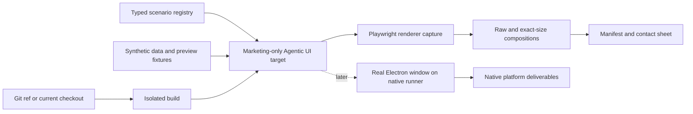

# Marketing Screenshot Automation

## Status

- **State:** Working renderer vertical slice, ready for review and iteration
- **Implementation branch:** `add-marketing-screenshot-system`
- **Primary consumers:** Studio Marketing and partner teams updating WordPress.com, Pressable,
  Automattic for Agencies, Microsoft Store, documentation, and launch materials
- **Primary product surface:** The Agentic UI in `apps/ui`

### Implemented checkpoint

The first runnable slice on this branch includes:

- deterministic `add-site`, `site-overview`, and `agent-complete-preview` scenarios;
- scenario-owned panel states and responsive sidebar/preview proportions, with per-run CLI overrides;
- explicit light and dark rendering with a fixed clock, locale, timezone, and reduced motion;
- `smoke`, `raw-default-2x`, `raw-wide-2x`, and `store-4k` presets;
- a marketing-only static preview fixture with no account, site, or external network dependency;
- exact-dimension PNG validation, diagnostics, a JSON manifest, and an HTML contact sheet; and
- the one-command `npm run screenshots:marketing` build-and-capture workflow.

The other scenarios, arbitrary one-off dimensions/composition, Git-ref orchestration, CI artifact
publishing, and genuine per-OS Electron captures remain follow-up phases described below.

## Summary

Build a repeatable, deterministic screenshot system for the Studio Agentic UI. The system will
render production UI components against curated synthetic scenarios, capture them in light and dark
themes at reusable source sizes, and export exact-size assets plus a manifest and contact sheet to an
ignored output folder.

The first implementation will optimize for reliable, high-resolution renderer captures that can be
generated locally or in CI from any Git ref. Genuine macOS, Windows, and Linux window captures will
be a separate fidelity tier because native window controls cannot be reproduced accurately on a
different host operating system.

### Review focus

The most consequential decisions are:

1. Approve a deterministic renderer generator as the first implementation branch, with native
   platform capture following in separate spikes.
2. Approve the six required version-one scenarios, especially the completed agent-plus-preview hero.
3. Approve synthetic fixture content rather than live accounts, AI runs, and mutable local sites.
4. Approve a small canonical preset set plus arbitrary one-off dimensions.
5. Decide where approved outputs are promoted after generation and how long CI artifacts remain.
6. Decide whether the first public refresh requires genuine macOS imagery or can start with renderer
   masters while native capture is validated.

## Context

Studio screenshots are used across surfaces with different aspect ratios, content needs, and update
cadences. Known consumers include:

### WordPress.com developer properties

- <https://developer.wordpress.com/studio/>
- <https://developer.wordpress.com/>
- Studio documentation under <https://developer.wordpress.com/docs/>

### Microsoft Store

- <https://apps.microsoft.com/detail/9pntbl35pzvs?hl=en-US&gl=US>

Microsoft currently accepts desktop screenshots at 1366 × 768 pixels or larger and supports 4K
images at 3840 × 2160. It recommends at least four screenshots and permits up to ten. Store images
must be PNG files no larger than 50 MB. Microsoft asks that critical visuals remain in the top
two-thirds because the bottom third may receive text overlays, and that screenshots not add extra
logos, icons, or marketing messages.

See: <https://learn.microsoft.com/en-us/windows/apps/publish/publish-your-app/msix/screenshots-and-images>

### Pressable

- <https://pressable.com/features/build/studio-local-development/>
- <https://pressable.com/knowledgebase/studio-for-pressable/>
- <https://pressable.com/changelog/studio-sync-now-works-with-pressable/>

### Automattic for Agencies

- <https://automattic.com/for-agencies/blog/local-wordpress-development/>
- <https://agencies.automattic.com/resources-and-tools/dev-tools>

Today, producing updates for all of these placements requires manually preparing Studio data,
navigating to a desired state, resizing a window, switching themes, and capturing or recomposing the
result. That process is slow, difficult to repeat, vulnerable to private data appearing in an image,
and likely to drift as trunk changes.

The Agentic UI is well suited to a deterministic capture harness because the application accepts a
portable `Connector` implementation. The Electron renderer, local browser UI, and hosted UI already
use different connectors while sharing the same React component tree.

## Goals

1. Generate a useful, curated screenshot set from the latest trunk or another exact Git ref.
2. Render the real Agentic UI components rather than recreating product screens in design software.
3. Keep all captured names, sites, accounts, conversations, and thumbnails synthetic and approved.
4. Reproduce each scenario without a WordPress.com login, paid API, live AI run, or personal Studio
   configuration.
5. Capture light and dark themes explicitly, independent of the host's current appearance setting.
6. Produce flexible high-resolution source captures and exact-size export presets.
7. Support targeted reruns by scenario, theme, platform treatment, and export preset.
8. Record the exact source commit and capture parameters beside every output set.
9. Make review easy through a generated contact sheet and machine-readable manifest.
10. Preserve a path to genuine macOS, Windows, and Linux application-window screenshots.

## Non-goals

- Automatically publishing assets to WordPress.com, Pressable, Microsoft Partner Center, or another
  external service.
- Treating marketing screenshots as a replacement for functional E2E tests or visual-regression
  coverage.
- Exercising live WordPress.com, Pressable, authentication, sync, or model-provider services during
  routine capture runs.
- Producing pixel-identical native window controls for one operating system on another operating
  system.
- Generating final marketing copy, captions, or localization in the first version.
- Committing generated screenshot binaries to the Studio repository by default.
- Capturing the legacy `apps/studio` renderer unless a future request explicitly adds it.

## Terminology

- **Scenario:** Named synthetic Studio state, route, data set, and readiness conditions.
- **Renderer capture:** Pixels produced from the Agentic React UI in a controlled browser viewport.
- **Host profile:** The connector capabilities and platform signals used to exercise browser,
  macOS, Windows, or Linux renderer behavior. A host profile is simulated unless captured through
  the matching native tier.
- **Native capture:** The actual Electron application window captured on its host operating system.
  The manifest additionally records whether the host is a development or packaged application.
- **Raw source:** High-resolution UI capture with no marketing background or text treatment.
- **Composition:** An exact-size canvas containing a raw Studio window or UI capture, with approved
  padding and background but no unapproved promotional claims.
- **Preset:** Named output dimensions and composition rules, such as `store-4k` or `article-wide`.
- **Capture set:** Every output generated for one Git commit.

## Product constraints discovered in the current code

### Shared Agentic UI

- `apps/ui/src/app/index.tsx` accepts a `Connector`, which is the main injection point for synthetic
  scenario data.
- The Electron entry uses the IPC connector.
- `studio ui` uses a local HTTP/SSE connector and can run in a normal browser.
- The same router, layouts, components, CSS modules, theme provider, and query hooks are used across
  those targets.

### Theme behavior

- `apps/ui` is wrapped in an application-wide WordPress Design System `ThemeProvider`.
- The saved `light`, `dark`, or `system` preference is authoritative.
- The capture harness must supply `light` or `dark` directly instead of relying on
  `prefers-color-scheme` alone.
- All initial scenarios must be reviewed in both themes even if only one theme is exported for a
  particular placement.

### Window behavior

- The default desktop window is 1100 × 820 logical pixels.
- The minimum is 712 × 600 logical pixels.
- macOS uses a frameless BrowserWindow with native traffic lights.
- Windows and Linux use a hidden title bar with an Electron title-bar overlay.
- The browser target deliberately omits native traffic-light space and reports its platform as
  `browser`.
- Host-specific renderer behavior is not controlled by one flag. Connector globals and capabilities
  affect traffic-light spacing and application-menu affordances, while a small amount of UI also
  consults browser platform signals. The capture harness must define these together as a host
  profile.
- Renderer screenshots do not prove that native window controls or shadows are correct.

### Site preview behavior

- Electron uses a `<webview>` for a running site's preview.
- A normal browser uses an `<iframe>` fallback.
- Marketing preview pages must be deterministic local fixtures served by the capture harness. They
  must not depend on a live Studio site port, external URL, or mutable production website.
- A small native-capture set may later use a real Playground site to validate the true `<webview>`
  integration.

### Existing build and isolation support

- `npm run cli:build:ui` builds the local browser UI and CLI.
- `studio ui --no-open` serves that UI through the local backend.
- `npm -w studio-app run package` builds the Electron renderers and packages the app.
- `DEV_CONFIG_DIR` isolates the normal Studio configuration path.
- Existing Electron E2E helpers also isolate app data, home, CLI config, and shared config through
  `E2E_*` environment variables.
- Existing Buildkite queues build Studio on macOS, Windows, and Linux and are potential hosts for
  later native captures.
- Existing Electron E2E data explicitly opts into the legacy renderer. Native marketing sessions
  will need a separate seed that enables the Agentic UI, disables DevTools, and suppresses first-run
  and What's New overlays.
- Studio's existing `screenshot-window.ts` captures WordPress-site thumbnails. Its dimensions,
  timing, and purpose do not make it a base for application marketing captures.

## Requirements

### Functional requirements

The capture command must:

1. Accept one or more scenarios.
2. Accept `light`, `dark`, or both themes.
3. Accept one or more named output presets.
4. Accept a renderer host profile and label simulated profiles accurately.
5. Accept an explicit output directory.
6. Capture from the current checkout by default.
7. Offer a wrapper that can resolve and capture an exact ref, including `origin/trunk`, without
   changing the user's active checkout.
8. Permit arbitrary output width and height for one-off placement needs.
9. Fail with a useful message when a scenario, preset, route, or required fixture is invalid.
10. Wait on an explicit scenario-ready signal rather than a fixed delay.
11. Produce `manifest.json` describing every generated file.
12. Produce an HTML contact sheet for visual review.
13. Exit non-zero if a requested capture is missing, blank, at the wrong dimensions, or contains a
    runtime error.

### Determinism requirements

Routine captures must:

- Use approved synthetic names, account details, site data, conversations, and media.
- Freeze the clock, timezone, random IDs, and other generated values, and provide fixed relative
  dates.
- Disable or finish transitions, caret blinking, progress animation, and onboarding animation.
- Hide the mouse cursor and avoid incidental hover, focus, tooltip, toast, and menu states unless the
  scenario specifically requests one.
- Reset query caches, browser storage, persisted panel widths, last-visited routes, onboarding hints,
  and session UI state between scenarios.
- Use a fresh browser context per capture because `apps/ui` has a singleton persisted TanStack Query
  client and several independent localStorage-backed preferences.
- Block unexpected outbound network requests and report them as errors.
- Wait for fonts, images, iframe fixtures, and scenario-specific asynchronous queries.
- Use a fixed locale (`en-US`) and left-to-right direction in version one.
- Use a fixed device scale factor and record it in the manifest.
- Generate outputs in the sRGB color space where the capture surface permits it.

### Privacy and content requirements

- The capture job must never read the normal `~/.studio` configuration or the user's `~/Studio`
  directory.
- Scenario content must not contain real access tokens, email addresses, local paths, domains,
  customer data, private site names, or chat history.
- Synthetic data should be visibly credible without representing an actual customer or making
  claims about a real business.
- Site fixture imagery must be owned by Automattic, appropriately licensed, or created for this
  purpose.
- The output manifest must state that scenario data is synthetic.

### Quality requirements

- Text and icons must be sharp at the target dimensions.
- No loading spinner, skeleton, missing thumbnail, broken image, clipped menu, or partial transition
  may appear unless intentionally part of the scenario.
- Light and dark captures must use the same scenario data and layout.
- The app must remain legible at every supported viewport.
- The default raw capture should be large enough to crop or scale down for article and landing-page
  placements without upscaling.
- Store presets must follow the current Microsoft Store screenshot requirements.
- Contact sheets must label commit, scenario, theme, platform treatment, logical viewport, pixel
  dimensions, and preset.

## Proposed architecture



### 1. Marketing-only UI target

Add a separate Vite target for screenshots. It will import the production `App` but use a dedicated
marketing connector and scenario registry.

Proposed files:

```text
apps/ui/
  index.marketing.html
  src/
    main.marketing.tsx
    marketing/
      connector.ts
      scenario-context.tsx
      scenarios.ts
      types.ts
      fixtures/
        preview-sites/
        thumbnails/
tools/
  marketing-screenshots/
    README.md
    capture.ts
    capture-ref.ts
    contact-sheet.ts
    native/
      macos.ts
      windows.ts
      linux.ts
    presets.ts
```

`STUDIO_TARGET=marketing` will produce `apps/ui/dist-marketing`. The marketing entry and fixtures
must not be imported by the normal Electron, local, or hosted entry points, so they do not add bytes
or synthetic data to shipped Studio bundles.

Implementation must also add the new build output to the relevant ignore/tooling configuration,
including `.gitignore`, TypeScript/ESLint resolution as needed, and `knip.json` when the new entry
would otherwise look unused.

The proposed file names are directional. During implementation, adjacent code may show that a
smaller structure is clearer, but the separation between production entries and the marketing entry
must remain.

### 2. Typed scenario registry

Each scenario will declare:

```ts
interface MarketingScenario {
	id: string;
	title: string;
	description: string;
	route: string;
	panelLayout: {
		sidebar: { state: 'expanded' | 'collapsed'; width: number };
		preview: { state: 'open' | 'closed'; widthRatio: number };
	};
	data: MarketingScenarioData;
	hostProfiles: MarketingHostProfile[];
	preferredViewport: Viewport;
	readyWhen: MarketingReadyCondition[];
	tags: string[];
}
```

The data object will provide the connector's sites, sessions, user, preferences, app globals,
capabilities, thumbnails, preview URLs, sync state, and other query results. Methods that a scenario
does not support should fail loudly when called, rather than silently returning unrelated defaults.
Each host profile must consistently set connector globals/capabilities, browser platform signals,
traffic-light reservation, application-menu affordances, fullscreen state, and Windows Store state.
Simulated profiles are useful for renderer coverage but must not be described as native captures.

Scenario selection should use a URL parameter or path understood only by the marketing entry, for
example:

```text
http://127.0.0.1:<port>/?scenario=agent-complete-preview&theme=dark
```

The scenario registry is the content-review surface. A reviewer should be able to understand all
synthetic claims and visible states without reading the connector implementation.

Panel defaults live with each scenario so captures do not inherit a developer's persisted split.
Preview width is expressed as a share of the available content frame rather than a fixed pixel
value, then converted to Studio's existing persisted content width before React mounts. This keeps
the intended composition stable across capture presets while retaining the product's minimum-width
clamps. The runner can override those defaults for one-off exports with `--preview-width-ratio`,
`--sidebar-width`, `--preview`, and `--sidebar`.

### 3. Deterministic preview fixtures

Preview scenarios will use static same-origin fixture sites served by the marketing Vite server.
Each fixture should represent a polished but neutral WordPress site and include only the pages needed
by the scenario.

The first implementation should avoid creating a full Playground site for every renderer capture.
That would increase runtime and introduce variability without improving the pixels visible inside the
preview frame. A real Playground fixture belongs in the later native-fidelity suite.

### 4. Explicit readiness contract

The marketing entry will expose an explicit, test-only readiness contract after:

- the scenario is validated;
- the required route is active;
- initial query data is resolved;
- fonts are ready;
- images and preview frames are loaded;
- animations are disabled or settled; and
- the page has no captured console or network errors.

The runner must wait for this signal. Fixed sleeps may be used only as a small post-ready paint guard,
not as the primary synchronization mechanism.

### 5. Playwright capture runner

Use the repository's existing Playwright dependency. The runner will:

1. Build or start the marketing UI target.
2. Start a loopback-only local server on a dynamically allocated port.
3. Create a fresh browser context per scenario/theme/host-profile combination.
4. Apply the requested viewport, device scale factor, reduced motion, locale, and theme.
5. Reject unapproved outbound requests.
6. Navigate to the scenario URL and wait for readiness.
7. Validate dimensions and a small set of required visible elements.
8. Capture raw and composed outputs.
9. Record console and network diagnostics.
10. Write the manifest and contact sheet.

The initial implementation must not add a second browser automation framework.

### 6. Output compositor

Exact-size compositions should be rendered in HTML/CSS by the marketing target where possible. A
composition canvas can keep a chosen logical Studio window size while scaling and positioning it
inside a larger export canvas. This preserves UI layout across aspect ratios and avoids adding an
image-processing dependency solely for padding and backgrounds.

Raw captures remain available for designers who need their own framing. Decorative backgrounds,
headlines, and product claims are outside the base screenshot set and should be added only through an
explicitly reviewed composition preset.

### 7. Git-ref orchestration

Two commands are proposed:

```text
npm run screenshots:marketing -- --scenario all --theme all --preset all
npm run screenshots:marketing:ref -- --ref origin/trunk --output <path>
```

The first runs inside the current checkout. The second will:

1. Resolve the requested ref to a commit SHA.
2. Create a detached temporary worktree at that SHA.
3. Install dependencies and build inside the temporary worktree.
4. Write outputs outside the temporary worktree.
5. Record the SHA in the manifest.
6. Remove the temporary worktree on success.

Fetching is an explicit option rather than an implicit side effect. For example,
`--fetch origin/trunk` may fetch before resolving the ref. On failure, the wrapper should report the
temporary path and optionally preserve it for diagnosis.

CI already checks out an exact SHA and will invoke the inner command directly.

The repository's local packaging helper currently excludes `out`, `dist`, and `test-results` when
copying the repository to its temporary staging directory, but not the top-level ignored
`artifacts/` folder. Before `artifacts/marketing-screenshots/` becomes the default output, the
implementation must exclude `artifacts` from that staging copy (or place the default output outside
the repository) so a large screenshot set is never copied into packaging work.

## Scenario catalog

### Version-one required scenarios

| ID                       | Visible state                                                        | Primary use                          | Preview fixture |
| ------------------------ | -------------------------------------------------------------------- | ------------------------------------ | --------------- |
| `add-site`               | Empty Studio state with create, connect, and import choices          | Onboarding and docs                  | None            |
| `site-overview`          | Sidebar with several sites and a selected running site's overview    | General product and site management  | Thumbnail only  |
| `agent-new-session`      | Selected site with an empty agent conversation and suggested prompts | Studio Code introduction             | Optional        |
| `agent-working-preview`  | Credible in-progress agent conversation beside a live preview        | Landing-page hero and agent workflow | Required        |
| `agent-complete-preview` | Completed task, concise result, and polished updated site preview    | Landing pages and Store              | Required        |
| `selective-sync`         | Selective Sync UI connected to a synthetic Pressable site            | Pressable and sync docs              | None            |

### Version-one optional scenarios

| ID                    | Visible state                                           | Primary use             |
| --------------------- | ------------------------------------------------------- | ----------------------- |
| `site-preview-full`   | Full in-app site preview with browser controls          | Preview feature docs    |
| `site-settings`       | Site runtime and configuration controls                 | Technical docs          |
| `appearance-settings` | Appearance setting with light, dark, and system options | Theme announcement/docs |
| `connect-site`        | WordPress.com and Pressable connection flow             | Sync onboarding docs    |
| `blueprint-create`    | Blueprint-based site creation flow                      | Blueprint docs          |

### Scenario-content guidelines

- Use two or three distinct synthetic sites so the sidebar feels credible without becoming noisy.
- Include running and stopped states only where they teach something.
- Use short site names that remain readable at narrow widths.
- Agent messages should demonstrate Studio's WordPress expertise without promising unsupported
  behavior.
- Tool activity should match real tool names and real UI rendering.
- Completed responses should be short enough to keep the preview and the outcome visible together.
- Pressable scenarios must use approved Pressable terminology and must not imply access to a real
  Pressable account.
- Avoid version numbers, dates, quotas, prices, and beta labels that become stale quickly unless the
  scenario is specifically meant to document them.

## Capture sizes and presets

### Logical UI viewports

Start with a small set of stable layouts rather than testing every output size as a different UI
viewport:

| ID                | Logical viewport | Purpose                                                 |
| ----------------- | ---------------- | ------------------------------------------------------- |
| `desktop-default` | 1100 × 820       | Matches Studio's default window                         |
| `desktop-wide`    | 1440 × 900       | Preferred split agent/preview layout                    |
| `desktop-large`   | 1600 × 1000      | High-detail flexible source                             |
| `desktop-minimum` | 712 × 600        | Responsive safety check, not a default marketing export |

Raw source captures should normally use a device scale factor of 2.

### Initial export presets

| ID               | Pixel output | Intended use                              |
| ---------------- | ------------ | ----------------------------------------- |
| `raw-default-2x` | 2200 × 1640  | Exact 2× default Studio window            |
| `raw-wide-2x`    | 2880 × 1800  | Flexible raw source                       |
| `store-4k`       | 3840 × 2160  | Microsoft Store and 16:9 master           |
| `store-minimum`  | 1366 × 768   | Store validation and lightweight delivery |
| `article-wide`   | 2048 × 1280  | Documentation, blog, and partner pages    |
| `landing-wide`   | 2400 × 1350  | Landing-page hero/source                  |
| `square`         | 2160 × 2160  | Cards or social crops when requested      |

`--width` and `--height` will support one-off exact outputs. The user must also select whether the UI
should reflow to that logical viewport or retain a named logical viewport inside a composed canvas.
The command should default to retaining the scenario's preferred logical viewport.

## Output contract

Generated files will go under the existing ignored `artifacts/` directory by default:

```text
artifacts/marketing-screenshots/
  <commit-sha>/
    manifest.json
    contact-sheet.html
    contact-sheet.png
    diagnostics/
    agent-complete-preview/
      renderer/
        light/
          raw-wide-2x.png
          store-4k.png
        dark/
          raw-wide-2x.png
          store-4k.png
      native/
        macos/
        windows/
        linux/
```

Every manifest entry should include:

- schema version;
- Studio commit SHA;
- dirty-worktree state;
- scenario ID and content revision;
- theme;
- capture tier (`renderer` or `native`);
- host profile and whether it is simulated;
- operating system and application mode (`browser`, `development`, or `packaged`);
- requested and actual outer-window bounds where applicable;
- requested and actual content bounds;
- logical viewport, browser device scale factor, and OS display scale;
- output preset and pixel dimensions;
- crop, padding, background, and shadow policy;
- relative output path;
- capture timestamp;
- synthetic-data declaration; and
- warnings or diagnostics.

The timestamp is metadata only and must not appear in scenario pixels.

## Native platform captures

### Why this is separate

The renderer tier can cover most landing pages, documentation, partner pages, and design handoff. It
cannot prove the appearance of native traffic lights, title-bar overlays, window shadows, system font
rasterization, or platform-specific menus.

Native captures must run on the operating system they claim to represent:

- macOS captures on a macOS runner;
- Windows captures on a Windows runner; and
- Linux captures on a Linux runner with a known display server and window manager.

The existing Linux Electron E2E environment uses Xvfb and software rendering inside a container.
That is valuable deterministic Linux renderer coverage, but it is not an authentic Ubuntu/GNOME (or
other desktop) window and shadow. Until a real desktop runner or VM is provisioned, those outputs
must be labeled headless Linux renderer captures rather than native Linux marketing captures.

### Proposed native strategy

1. Compare `page.screenshot()`, `webContents.capturePage()`, and OS-level window capture on each
   target host before choosing the adapter.
2. Reuse the deterministic scenario data where practical.
3. Launch Electron with isolated `E2E_*` directories and an explicit Agentic UI preference.
4. Set exact window bounds after launch and verify the content bounds.
5. Capture the complete application window through a small OS-specific adapter.
6. Validate the resulting dimensions and crop bounds.
7. Generate light and dark variants on the same runner.

The exact capture APIs require a spike. `webContents.capturePage()` is useful for renderer pixels but
does not guarantee native window chrome. `BrowserWindow.getMediaSourceId()` may provide a stable
native window handle, but OS-level window capture can still require permissions or display
configuration, especially on macOS and headless Linux.

The spike should begin with an actual development BrowserWindow because it is cheaper than full
Forge packaging. A packaged, unsigned application should be compared before declaring that the
development host is visually equivalent. Signed-release packaging is not required unless that
comparison reveals a visible difference.

### Native tier acceptance criteria

- The image contains the expected native controls and no desktop background outside the intended
  crop.
- No screen-recording permission prompt or system notification appears.
- Window dimensions and scale factor are recorded.
- The capture is repeatable on a clean runner.
- The Microsoft Store set is captured from Windows, not a simulated Windows frame.
- The output is labeled as development or packaged.

### Window shadow and background policy

Native shadows make exact cropping, transparency, and cross-platform comparison difficult. The
native spike must decide which of these products are needed:

- renderer-only raw PNG;
- native window-only capture with no desktop background and no shadow where possible;
- native window capture with the genuine OS shadow; and
- composed marketing canvas with a consistent approved background and shadow.

The recommended default is a raw renderer source plus a consistent composed canvas. Genuine OS
shadow variants should be optional deliverables rather than the only reusable source.

## Validation and review workflow

### Automated validation

For every requested output:

- verify the file exists and is decodable;
- verify exact pixel dimensions;
- reject nearly blank or single-color images;
- assert the scenario-ready signal was observed;
- assert required labels or test IDs were present before capture;
- fail on uncaught page errors or unexpected console errors;
- fail on unexpected outbound network requests;
- report missing images and fonts;
- verify light and dark outputs are not byte-identical; and
- ensure the output paths listed in the manifest match the files on disk.

Unit tests should cover scenario ID uniqueness and schema validation, complete `Connector` typing,
fixture existence, preset and scale calculations, output paths, and manifest serialization. A
Playwright smoke test should render every required scenario at least once, with a smaller committed
subset used for routine end-to-end capture validation.

Renderer masters should be reproducible byte-for-byte when the pinned browser/runtime is unchanged,
or within a documented tolerance if image metadata prevents exact equality. Native deliverables
should receive human visual review rather than becoming brittle pixel-golden CI assertions across OS
updates.

### Repository verification

Implementation changes must follow the repository's standard checks:

```text
npx eslint --fix <modified TypeScript/React files>
npm run typecheck
npm test -- <relevant tests>
npm run screenshots:marketing -- --scenario <smoke-scenario> --theme all
```

Any changed UI/CSS must be inspected in both themes. The capture system itself should make that
review easier by generating paired outputs and a contact sheet.

### Human review

The contact sheet is the review entry point. A reviewer should check:

- product correctness;
- content and terminology;
- privacy and synthetic-data safety;
- light/dark quality;
- clipping and responsive layout;
- preview-site visual quality;
- OS fidelity for native captures; and
- suitability for each requested placement.

The tool should not overwrite an approved external asset library automatically. Promotion to a DAM,
shared Drive, Figma, or website repository remains a deliberate human action.

## Delivery phases

### Phase 0: Approve the plan and content direction

- Review this design document.
- Choose the version-one required scenario list.
- Approve synthetic site names, preview-site art direction, and agent conversation content.
- Confirm initial output presets and where reviewed files should ultimately live.

**Exit criterion:** The implementation branch has an agreed scope and no unresolved decision that
would materially change its architecture.

### Phase 1: Deterministic renderer proof of concept

- Add the marketing Vite target.
- Add the typed scenario registry and fail-fast marketing connector.
- Implement `add-site`, `site-overview`, and `agent-complete-preview`.
- Add explicit readiness and network blocking.
- Capture light/dark raw outputs.
- Generate a minimal manifest and HTML contact sheet.

**Exit criterion:** One command produces stable paired screenshots from a clean checkout without
reading personal Studio data or accessing external services.

### Phase 2: Complete the renderer catalog and export presets

- Implement all required scenarios.
- Add deterministic preview fixtures.
- Add exact-size compositions and arbitrary-size options.
- Add PNG contact sheet, diagnostics, dimension validation, and content revisioning.
- Add the ref/worktree wrapper.
- Document local usage and content-editing workflow.

**Exit criterion:** Alex can generate the complete reviewed renderer set from `origin/trunk` into one
folder and select assets by scenario, theme, and preset.

### Phase 3: Native macOS spike

- Launch the true Electron application with isolated data.
- Compare browser-page, `capturePage`, and OS-level window-capture results.
- Test OS-level full-window capture on a macOS development machine and Buildkite Mac agent.
- Compare development and packaged Electron windows for visible differences.
- Capture default, wide, light, and dark variants.
- Document permissions and known pixel differences.

**Exit criterion:** A clean macOS runner can produce a repeatable full-window image with native
traffic lights.

### Phase 4: Windows and Linux native captures

- Implement and validate the Windows window-capture adapter.
- Produce the Microsoft Store set from a Windows runner.
- Keep Linux as headless renderer coverage unless/until a real desktop runner or VM is available.
- If authentic Linux imagery is required, implement capture under a named, fixed desktop environment.
- Publish all platform outputs as Buildkite artifacts.

**Exit criterion:** Windows generates authentic native-window captures, the Store outputs meet
Microsoft's current size requirements, and Linux is either backed by an agreed real desktop
environment or explicitly labeled as headless renderer coverage.

### Phase 5: Operationalize refreshes

- Add an on-demand Buildkite pipeline or manual trigger.
- Cache dependency/runtime downloads by lockfile and commit inputs.
- Define ownership for scenario content and visual approval.
- Define when screenshots should be refreshed, such as major UI launches or before releases.
- Add retention and promotion guidance for generated artifacts.

**Exit criterion:** A documented owner can refresh, review, and hand off the asset set without help
from the original implementer.

## Proposed implementation-branch scope

The first implementation branch should cover Phases 1 and 2 only. It should remain a tooling change
with no behavior change in the shipped Electron, local, or hosted applications.

Expected changes:

- marketing-only Vite entry and build target;
- marketing connector and typed scenario registry;
- synthetic preview and thumbnail fixtures;
- Playwright capture/ref orchestration;
- manifests, contact sheets, diagnostics, and presets;
- unit tests for scenarios, configuration, and manifest generation;
- one capture smoke test; and
- usage documentation.

Native platform automation should follow in separate branches after the macOS spike answers the
permissions and capture-API questions. Separating the work avoids making the reliable renderer tool
wait on OS-specific infrastructure.

Because the eventual native/CI system crosses build, Electron, tooling, and infrastructure
boundaries, that work should begin as a draft Proof of Concept with a companion issue. The
renderer-only generator can remain the smaller, reviewable first implementation branch.

## Risks and mitigations

### Scenario connector drifts from the production connector

**Risk:** A large fake connector can silently fall behind new required methods.

**Mitigation:** Type it as a complete `Connector`, centralize unsupported methods in a fail-fast base,
run it through normal typechecking, and exercise every required scenario in CI.

### Marketing state becomes more polished than the real product

**Risk:** Synthetic state accidentally depicts capabilities or UI combinations users cannot reach.

**Mitigation:** Build scenarios from actual routes and production component contracts. Require a
Studio product reviewer for scenario-content changes.

### Preview fixture and app state disagree

**Risk:** The agent claims to have made a change that the preview does not show.

**Mitigation:** Keep agent messages and preview fixture revisions together in one scenario directory
and review them as one unit.

### Hidden persistence contaminates captures

**Risk:** Query persistence, localStorage, panel widths, or last-visited routes change layout between
runs.

**Mitigation:** Use a fresh browser context per capture and explicitly seed all visible preferences.

### Font and rendering differences create noisy output

**Risk:** Browser or OS updates produce small antialiasing differences.

**Mitigation:** Pin the browser through the lockfile, record runtime versions, avoid brittle
pixel-perfect pass/fail thresholds, and use human contact-sheet review for marketing approval.

### Native capture requires permissions

**Risk:** macOS screen-recording permissions or Linux display setup blocks unattended capture.

**Mitigation:** Keep native capture out of the first implementation branch and prove each runner in a
small spike before promising it as a routine output.

### Linux CI does not represent a normal Linux desktop

**Risk:** A container/Xvfb capture is presented as an authentic Linux application window.

**Mitigation:** Label existing Linux output as headless renderer coverage. Require a named real
desktop environment before publishing Linux-native chrome or shadow imagery.

### Screenshot artifacts make local packaging expensive

**Risk:** The ignored top-level `artifacts/` directory is copied into the local package-isolation
staging tree.

**Mitigation:** Exclude `artifacts` in `scripts/package-in-isolation.ts` or default captures outside
the repository before generating large sets there.

### Full ref orchestration is expensive

**Risk:** A clean worktree install downloads Studio's WordPress and PHP runtime and makes quick
refreshes slow.

**Mitigation:** Separate inner capture from ref orchestration, reuse npm/runtime caches, and key CI
caches from the lockfile and relevant download-script inputs.

### Output presets become a maintenance burden

**Risk:** Every website adds a bespoke size that must be kept forever.

**Mitigation:** Maintain a small set of canonical raw and composition presets, support one-off exact
dimensions from the CLI, and add named presets only when they are reused.

## Open decisions for review

1. Are the six required version-one scenarios the right initial catalog?
2. Should `agent-complete-preview` or `agent-working-preview` be the default landing-page hero state?
3. What synthetic site names, visual subject, and agent prompt best represent Studio without becoming
   stale?
4. Is English-only output sufficient for version one?
5. Should the default flexible raw source be `desktop-wide` or `desktop-large`?
6. Which compositions, if any, may include decorative backgrounds rather than only the Studio UI?
7. Where should approved outputs be promoted after generation: a shared Drive, Figma, a DAM, or the
   consuming repositories?
8. How long should CI artifacts and prior commit capture sets be retained?
9. Is genuine Linux marketing imagery needed routinely, or only for OS-specific documentation?
10. Should native macOS capture be a prerequisite for the first public asset refresh or a follow-up?
11. Should native sources include the genuine OS shadow, a consistent composed shadow, or both?
12. Does “native” require a packaged app, or is a real development BrowserWindow acceptable after a
    one-time packaged comparison?

## Recommended decisions

Unless review changes them, implementation should proceed with these defaults:

- Build the renderer tier first and treat native capture as a follow-up.
- Include the six required scenarios and defer the optional list.
- Use `agent-complete-preview` as the default hero because it communicates both the agent outcome and
  the site being built.
- Generate English, light, and dark outputs.
- Use `desktop-wide` at 2× as the default flexible source.
- Generate `store-4k`, `article-wide`, and `landing-wide` compositions initially.
- Keep generated files ignored under `artifacts/marketing-screenshots/` and publish CI runs as
  Buildkite artifacts.
- Require Windows-native output for the Microsoft Store set.
- Keep decorative copy and final campaign art outside the base capture pipeline until a reusable
  composition is explicitly approved.

## Definition of done for the first implementation branch

The initial implementation is complete when:

- a clean checkout can run the documented command;
- the command reads no personal Studio configuration;
- all six required scenarios render from approved synthetic data;
- each scenario captures in light and dark mode;
- raw and initial preset outputs have exact dimensions;
- unexpected external network access fails the run;
- the manifest and contact sheet describe every output;
- targeted scenario/theme/preset filtering works;
- the ref wrapper captures an exact trunk SHA without switching the active checkout;
- lint, typecheck, relevant unit tests, and the capture smoke test pass; and
- a product/marketing reviewer approves the generated contact sheet.
