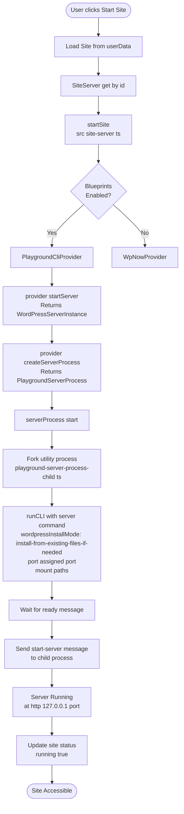
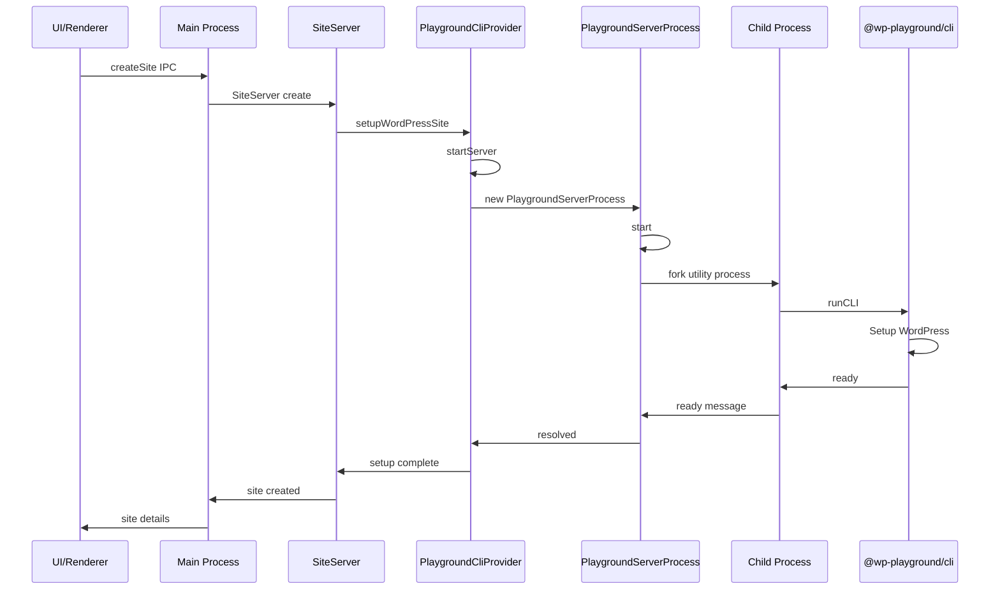

# Studio Playground CLI Workflow Diagram

## About this doc

This document outlines the design and implementation details for the flow of creating and starting a site with Blueprints. Also, information about the integration of Playground CLI, which replaces wp-now. It covers the high-level approach, data flow and details of teh implementation.

## Context

Before we used wp-now but since we are implementing support of Blueprints v2, we had to move to Playground CLI, since wp-now supported only Blueprints v1.

## Site Creation and Startup Flow

```mermaid
graph TB
    Start([User clicks Add Site]) --> Options[Add Site Options Screen]

    Options --> |Create Empty Site| CreatePath[Create Site Path]
    Options --> |Start from Blueprint| BlueprintSelect[Blueprint Selector]
    Options --> |Import from Backup| BackupSelect[Backup File Selector]

    BlueprintSelect --> |Select Blueprint| CreatePath
    BackupSelect --> |Select File| CreatePath

    CreatePath --> FillDetails["Fill Site Details<br/>Name Path PHP Version<br/>WP Version Custom Domain HTTPS"]

    FillDetails --> Submit[Submit Form]

    Submit --> CreateSite["createSite IPC Handler<br/>src ipc-handlers ts line 182"]

    CreateSite --> ValidatePath{Path Valid?}
    ValidatePath --> |No| Error[Show Error]
    ValidatePath --> |Yes| GetPort["portFinder getOpenPort"]

    GetPort --> CreateServer["SiteServer create<br/>src site-server ts line 74"]

    CreateServer --> SetMeta["Set Server Metadata<br/>wpVersion and blueprint"]

    SetMeta --> CheckProvider{Blueprints<br/>Enabled?}

    CheckProvider --> |Yes| UsePlaygroundCLI["Use PlaygroundCliProvider<br/>src lib wordpress-provider playground-cli"]
    CheckProvider --> |No| UseWpNow[Use WpNowProvider]

    UsePlaygroundCLI --> SetupWP["setupWordPressSite<br/>playground-cli-provider ts line 116"]

    SetupWP --> CheckOnline{Online?}

    CheckOnline --> |Offline| CopyBundled["Copy bundled WP files<br/>from resources wp-files latest"]
    CheckOnline --> |Online| StartSetupMode["Start in Setup Mode<br/>isSetupMode true"]

    CopyBundled --> InstallSQLite[Install SQLite Integration]

    StartSetupMode --> CreateInstance["provider startServer<br/>Creates WordPressServerInstance<br/>with PlaygroundCliOptions"]

    CreateInstance --> CreateProcess["provider createServerProcess<br/>Creates PlaygroundServerProcess"]

    CreateProcess --> StartProcess["serverProcess start<br/>playground-server-process ts line 27"]

    StartProcess --> ForkUtility["utilityProcess fork<br/>Spawns child process"]

    ForkUtility --> ChildProcess[playground-server-process-child ts]

    ChildProcess --> RunCLI["runCLI from wp-playground cli"]

    RunCLI --> SetupMode{Setup Mode?}

    SetupMode --> |Yes| RunBlueprint["Command run-blueprint<br/>Installs WP if needed<br/>Runs blueprint steps<br/>Process exits on completion"]
    SetupMode --> |No| StartServer["Command server<br/>wordpressInstallMode: install-from-existing-files-if-needed<br/>Keeps process running"]

    RunBlueprint --> MountDirs["Mount Directories<br/>wordpress to site path<br/>internal studio mu-plugins<br/>internal shared mu-plugins"]

    StartServer --> MountDirs

    MountDirs --> ConfigureWP["Configure WordPress<br/>Set site title<br/>Set admin password<br/>Update site URL"]

    ConfigureWP --> SaveSite["Save to userData<br/>sites array"]

    SaveSite --> SiteReady([Site Ready])

    InstallSQLite --> SaveSite
```



## Starting an Existing Site



## Key Components

### 1. **Provider System** (`src/lib/wordpress-provider/`)

- **Provider Selection**: Based on `enableBlueprints` feature flag
  - `true` → PlaygroundCliProvider
  - `false` → WpNowProvider (legacy)
- **Provider Interface**: WordPressProvider with methods:
  - setupWordPressSite - Initial WP setup
  - startServer - Create server instance
  - createServerProcess - Create process handler

### 2. **PlaygroundCliProvider** (`playground-cli-provider.ts`)

- **Responsibilities**:
  - Creates `PlaygroundCliOptions` with port, PHP version, document root
  - Handles offline mode with bundled WordPress files
  - Manages blueprint execution in setup mode
  - Returns `WordPressServerInstance` with configuration

### 3. **PlaygroundServerProcess** (`playground-server-process.ts`)

- **Process Management**:
  - Uses Electron's utilityProcess.fork for child process
  - Message-based IPC communication
  - Handles start/stop/run-php commands
  - Manages process lifecycle and cleanup

### 4. **Child Process** (`playground-server-process-child.ts`)

- **Playground CLI Integration**:
  - Imports @wp-playground/cli package
  - Runs either run-blueprint (setup) or server (runtime)
  - Mounts local directories into Playground VFS
  - Handles PHP execution requests

### 5. **Mount Points**

```
Host System → Playground VFS
- Site Path → /wordpress
- Studio MU Plugins → /internal/studio/mu-plugins
- Loader Plugin → /internal/shared/mu-plugins/99-studio-loader.php
```

### 6. **Setup vs Runtime Modes**

| Mode         | Command       | Purpose                   | Process Behavior    |
| ------------ | ------------- | ------------------------- | ------------------- |
| Setup Mode   | run-blueprint | Install WP, run blueprint | Exits on completion |
| Runtime Mode | server        | Run existing site         | Keeps running       |

### 7. **Blueprint Support**

- Blueprints passed through `meta.blueprint` in SiteServer
- Executed during setup mode via Playground CLI
- Support for both WPCOM blueprints and file imports

## Communication Flow



## Error Handling

1. **Offline Mode**: Falls back to bundled WordPress files
2. **Process Timeouts**: 60s for setup mode, 30s for normal operations
3. **Exit Handling**: Graceful cleanup on process exit
4. **Message Queue**: Handles pending messages on unexpected exit

## File Structure

```
src/lib/wordpress-provider/
├── index.ts                        # Provider factory & exports
├── types.ts                        # Shared interfaces
├── playground-cli/
│   ├── index.ts                   # Public exports
│   ├── playground-cli-provider.ts # Main provider implementation
│   ├── playground-server-process.ts # Process wrapper
│   ├── playground-server-process-child.ts # Child process code
│   └── mu-plugins.ts              # MU plugin management
└── wp-now/                         # Legacy provider
```

## Notes for Team Members

1. **Feature Flag**: The Playground CLI provider is activated when `enableBlueprints` feature flag is true
2. **Process Architecture**: Uses Electron's utility process for isolation
3. **VFS Mounting**: All file access goes through Playground's virtual filesystem
4. **Blueprint Execution**: Happens during site creation, not on every start
5. **SQLite Integration**: Automatically installed if wp-config.php doesn't exist
6. **Port Management**: Uses portFinder to avoid conflicts
7. **Password Generation**: Automatic secure password for admin user
8. **Custom Domains**: Handled via proxy server and hosts file modifications
